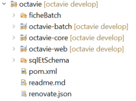

<style>
/* Réduction de la taille de police globale */
section {
  font-size: 20px;  /* Par défaut, Marp utilise souvent 28px */
}

/* Réduction des titres */
h1 {
  font-size: 36px; /* Par défaut, il est souvent autour de 48px */
}

h2 {
  font-size: 28px;
}

h3 {
  font-size: 20px;
}
</style>

# Initiation à Java

---

## Java : Un langage de programmation puissant

- Créé par **Sun Microsystems** en **1995**, maintenu par **Oracle** depuis 2009
- **Portable** grâce à la JVM, cela signifie que les programmes écrits en Java peuvent être exécutés sur différentes plateformes (Windows, macOS, Linux...) sans modification du code source.
- **Orienté objet** (POO) ce qui facilite la modularité et la réutilisation du code
- **Gestion automatique** de la mémoire (Garbage Collector) (allocation et libération de la mémoire de manière automatique)
- **Sécurisé et fiable**
- **Écosystème riche** (bibliothèques et frameworks)

---

## Types de données en Java

Java dispose de deux types de données, les types primitifs et les types référence.
Les types de référence incluent les classes, tableaux, annotations, interfaces, énumérations, et chaines de caractères permettant de créer des structures complexes.
On en parlera plus en détails par la suite.
Les types primitifs stockent des valeurs simples (nombres, caractères) et sont très efficaces car ils ont une taille fixe et sont stockés en mémoire.

---

Il existe 8 types primitifs :

| Type      | Taille  | Plage de valeurs  |
| --------- | ------- | ----------------- |
| `byte`    | 8 bits  | -128 à 127        |
| `short`   | 16 bits | -32 768 à 32 767  |
| `int`     | 32 bits | -2³¹ à 2³¹-1      |
| `long`    | 64 bits | -2⁶³ à 2⁶³-1      |
| `float`   | 32 bits | Nombre flottant   |
| `double`  | 64 bits | Nombre flottant   |
| `char`    | 16 bits | Caractère Unicode |
| `boolean` | 1 bit   | `true` ou `false` |

---

## Opérateurs en Java

- **Arithmétiques** : `+`, `-`, `*`, `/`, `%`
- **Comparaison** : `==`, `!=`, `>`, `<`, `>=`, `<=`
- **Logiques** : `&&`, `||`, `!`
- **Affectation** : `=`, `+=`, `-=`, `*=`, `/=`, `%=`

---

## Déclarer des variables en Java

```java
type_variable nom_variable;
System.out.println("nom de notre variable : " + nom_variable); // permet d'afficher la valeur de la variable dans la console
// permet d'écrire des commentaires dans le code
```

où type_variable est l'un des types de données Java comme int ou float par exemple et nom_variable le nom que l'on choisit.
Une ligne se finie par le ;.
System.out.println permet d'afficher dans la console ce qu'on lui passe en paramètre.
L'opérateur + permet ici de faire de la concaténation de chaine de caractère.

---

## Création d'une classe dans Eclipse

1. **Ouvrir Eclipse** → File > New > Java Project
2. **Nommer le projet** et cliquer sur _Finish_
3. **Créez une package** : Clic droit sur `src` → New > Package
4. **Créez une classe** Clic droit sur `monpackage` → New > Class (ex: `Exercice1`) et cocher `public static void main(String[] args)`
5. **Cliquez sur Finish**
6. **Compilez** clic droit > Run as > Java application

Si vous n'avez pas encore installé votre IDE vous pouvez commencer à coder sur https://www.online-java.com/

---

## Création d'une classe dans Vs Code

1. **Créez un projet Java**

   Ouvrez VsCode
   Nouveau Fichier > New Java Project > No build tools

2. **Créez un package** Clic droit New Java Package
3. **Créez un classe** Sur le package clic droit New Java File > class > Exercice1.java
   ```java
   package monpackage;
   public class Exercice1 {
   public static void main(String[] args) {
       System.out.println("Hello, World!");
       }
   }
   ```
4. **Executez** en cliquant sur le bouton Run, le résultat s'affiche dans la console de débogage (Ctrl+Maj+Y).

---

Pourquoi utiliser des packages ?

    ✅ Organisation propre du projet
    ✅ Évite les conflits de noms
    ✅ Contrôle des accès aux classes
    ✅ Facilite la maintenance et la collaboration
    ✅ Favorise la réutilisation du code

C’est indispensable pour gérer un projet Java propre et efficace !

---

## La méthode `main`

```java
public class Exercice1 {
    public static void main(String[] args) {
        System.out.println("Hello, Java!");
    }
}
```

la méthode **main** est le point d’entrée du programme

---

## Convention de nommage

Par convention on écrira :
les noms de **package** en **minuscules**,
les noms de **classe** en **PascalCase**,
les noms de **méthodes** en **camelCase**.
On utilisera des noms significatifs et on évitera les abréviations inutiles.

---

## Exercice 1

Dans la classe Exercice1 :

1. **Déclarez** deux variables `a` et `b` dans la méthode main
2. **Affectez-leur** des valeurs
3. **Effectuez des opérations arithmétiques**
4. **Affichez les résultats** avec `System.out.println()` dans la méthode main

<details>
  <summary>Afficher le code</summary>

```java
public static void main(String[] args) {
    int a = 10;
    int b = 5;
    System.out.println("Somme : " + (a + b));
    System.out.println("Produit : " + (a * b));
}
```

</details>

---

## Conversion de types

### Conversion implicite (widening)

Se produit automatiquement lorsque Java convertit un type plus petit vers un type plus grand (sans risque de perte de données).

```java
int a = 10;
double b = a;
System.out.println(b); // Affiche 10.0
```

### Conversion explicite (casting)

Nécessite un casting manuel ((type) valeur) car elle peut entraîner une perte de données.

```java
double x = 9.7;
int y = (int) x;
System.out.println(y); // Affiche 9 (partie décimale perdue)

```

---

### Conversion entre String et Types Numériques

De String vers int, double, etc.

```java
String str = "123";
int num = Integer.parseInt(str);
double d = Double.parseDouble("45.67");

System.out.println(num + 10); // 133
System.out.println(d + 0.33); // 46.0
```

De int, double, etc. vers String

```java
int valeur = 50;
String texte = String.valueOf(valeur); // "50"
System.out.println(texte + " est une chaîne !"); // "50 est une chaîne !"
```

---

## Tableaux en Java

### Les tableaux classiques (Array)

Un tableau en Java est une structure de données statique qui stocke plusieurs valeurs du même type.

```java
// Déclaration et initialisation explicite
int[] nombres = {10, 20, 30, 40, 50};

// Déclaration avec une taille fixe, puis remplissage
String[] noms = new String[3]; // Tableau de taille 3
noms[0] = "Alice";
noms[1] = "Bob";
noms[2] = "Charlie";

// Accèder aux éléments d'un tableau
System.out.println(noms[0]); // Affiche "Alice"
System.out.println(noms[2]); // Affiche "Charlie"

```

---

### Parcourir un tableau

```java
for (int i = 0; i < nombres.length; i++) {
    System.out.println(nombres[i]);
}

for (String nom:noms){
    System.out.println(nom);
}
```

Problème des tableaux fixes :

Une fois la taille du tableau définie, on ne peut pas l’agrandir ou le rétrécir.

---

### Les ArrayList (Listes dynamiques)

```java
import java.util.ArrayList;

ArrayList<String> noms = new ArrayList<>();
noms.add("Alice");
noms.add("Bob");
noms.add("Charlie");

System.out.println(noms.get(0)); // Affiche "Alice"
System.out.println(noms.get(2)); // Affiche "Charlie"

noms.add("David"); // Ajoute un élément à la fin
noms.remove(1);    // Supprime "Bob" (index 1)
System.out.println(noms); // Affiche [Alice, Charlie, David]


```

On utilise une ArrayList si on veux pouvoir ajouter ou supprimer des éléments facilement ou si on ne connais pas la taille exacte à l’avance.

---

## Conditions en Java

```java
if (a == b) {
    System.out.println("la valeur de a est égale à celle de b");
} else if ("a".equals("a")) {
    System.out.println("les chaines de caractères sont bien les mêmes");
} else {
    System.out.println("cette formation est super");
}
```

---

## Boucles en Java

### Boucle `for`

```java
for (int i = 0; i < 10; i++) {
    System.out.println(i);
}
```

pour stopper une boucle :

```java
for (int i = 0; i < 10; i++) {
    System.out.println(i);
    if (i == 8){
        break;
    }
}
```

pour stopper une itération :

```java
for (int i = 0; i < 10; i++) {
    if (i == 8){
        continue;
    }
    System.out.println(i);
}
```

---

### Boucle `while`

```java
int j = 0;
while (j < 10) {
    System.out.println(j);
    j++;
}
```

### Boucle `do-while`

```java
int k = 0;
do {
    System.out.println(k);
    k++;
} while (k < 10);
```

---

### `switch` en Java

```java
int jour = 3;
switch (jour) {
    case 1:
        System.out.println("Lundi");
        break;
    case 2:
        System.out.println("Mardi");
        break;
    default:
        System.out.println("Autre jour");
}
```

---

## Exercice 2 : Gestion d'un emploi du temps

Pour que votre projet reste clair, créez un nouveau package et une nouvelle classe.

Vous êtes responsable d'un emploi du temps pour une petite équipe. Voici les tâches à réaliser :

- Créer un tableau qui contiendra les noms des 5 membres de l'équipe.
- Afficher les noms des membres de l'équipe à l'aide d'une boucle for.
- Utiliser une condition pour vérifier si un membre spécifique, par exemple "Alice", est présent dans le tableau. Si oui, afficher "Alice est dans l'équipe" ; sinon, afficher "Alice n'est pas dans l'équipe".
- Ajouter un nouveau membre à l'équipe et afficher la liste mise à jour.
- Afficher le nombre total de membres de l'équipe après l'ajout du nouveau membre.

---

### Correction Exercice 2 `EmploiDuTemps`

<details>
  <summary>Afficher le code</summary>

```java
import java.util.ArrayList;

public class EmploiDuTemps {
    public static void main(String[] args) {
        // 1. Déclaration et initialisation du tableau des membres
        ArrayList<String> membres = new ArrayList<>();
        membres.add("Alice");
        membres.add("Bob");
        membres.add("Charlie");
        membres.add("David");
        membres.add("Eve");

        // 2. Affichage des membres
        System.out.println("Les membres de l'équipe sont :");
        for (String membre : membres) {
            System.out.println(membre);
        }

        // 3. Vérifier si "Alice" est dans l'équipe
        if (membres.contains("Alice")) {
            System.out.println("Alice est dans l'équipe.");
        } else {
            System.out.println("Alice n'est pas dans l'équipe.");
        }

        // 4. Ajouter un nouveau membre
        String nouveauMembre = "Leon";
        membres.add(nouveauMembre);

        // 5. Afficher la nouvelle liste des membres
        System.out.println("\nMise à jour de l'équipe :");
        for (String membre : membres) {
            System.out.println(membre);
        }

        // 6. Afficher le nombre total de membres
        System.out.println("L'équipe compte maintenant " + membres.size() + " membres.");

    }
}
```

</details>

---

## Java : Langage Orientée Objet (POO)

- Java repose sur le concept d'**objets** et de **classes**.
- Facilite la **modularité** et la **réutilisation du code**.
- Basé sur **4 grands principes** :
  - **Encapsulation** 🛡️
  - **Héritage** 👪
  - **Polymorphisme** 🎭
  - **Abstraction** 🎭

---

## Introduction à une Classe en Java

Une **classe** en Java est un modèle (ou un plan) utilisé pour créer des objets.  
Elle définit des propriétés et des comportements que les objets de ce type auront.

Elle permet de regrouper des données (variables) et des méthodes (fonctions) sous un même toit,  
facilitant ainsi l'organisation du code et l'encapsulation des comportements.

---

## Structure d'une Classe en Java

Une classe peut être vue comme une combinaison de deux éléments principaux :

1. **Attributs (ou variables d'instance)**  
   Ce sont des propriétés ou des caractéristiques de la classe. Elles représentent l'état de l'objet.

2. **Méthodes (ou fonctions)**  
   Ce sont des actions ou des comportements que l'objet peut effectuer.  
   Les méthodes manipulent les attributs et peuvent interagir avec d'autres objets.

---

## Détails Importants sur une Classe en Java

**Déclaration d'une classe**

- La classe est définie avec le mot-clé `class`.
- Elle peut être publique (public) ou avoir une visibilité par défaut.

  - public : La classe peut être accessible de n'importe quelle autre classe.
  - Visibilité par défaut : La classe est accessible uniquement dans le même package.

- Le nom de la classe se fait en PascalCase par convention.

---

### Exemple de Syntaxe de Base

```java
public class NomDeLaClasse {
    // Attributs (ou variables d'instance)
    private String nom;
    private int age;

    // Constructeur (pour initialiser les objets)
    public NomDeLaClasse(String nom, int age) {
        this.nom = nom;
        this.age = age;
    }

    // Méthodes (ou comportements)
    public void afficherInfo() {
        System.out.println("Nom: " + nom + ", Âge: " + age);
    }

    public void anniversaire() {
        age++;
    }
}
```

---

## Les Getters et Setters

En Java, les getters et setters sont des méthodes d'accès utilisées pour contrôler la lecture et la modification des attributs d'une classe.

    🔹 Getter (get) → Récupère la valeur d'un attribut.
    🔹 Setter (set) → Modifie la valeur d'un attribut avec un contrôle d'accès.

📌 Pourquoi utiliser des getters et setters au lieu d'accéder directement aux variables ?

    ✅ Encapsulation : Protection des données.
    ✅ Validation : Vérification avant modification.
    ✅ Flexibilité : Possibilité d'ajouter de la logique supplémentaire.

---

### Exemple de Base : Sans Getters/Setters

```java
public class Personne {
    public String nom;
}

public class Main {
    public static void main(String[] args) {
        Personne p = new Personne();
        p.nom = "Alice";  // Accès direct à l’attribut (pas sécurisé)
        System.out.println(p.nom);
    }
}
```

❌ Problèmes :

    N’importe qui peut modifier nom sans contrôle.
    Impossible d'ajouter des restrictions (ex : empêcher un nom vide).

---

### Implémentation avec Getters et Setters

```java
public class Personne {
    private String nom; // Attribut privé (encapsulation)
    // Getter : Récupère le nom
    public String getNom() {
        return nom;
    }
    // Setter : Modifie le nom avec validation
    public void setNom(String nom) {
        if (nom == null || nom.trim().isEmpty()) {
            System.out.println("Erreur : Le nom ne peut pas être vide !");
        } else {
            this.nom = nom;
        }
    }
}
public class Main {
    public static void main(String[] args) {
        Personne p = new Personne();
        p.setNom("Alice");  // Modification sécurisée
        System.out.println("Nom : " + p.getNom()); // Lecture sécurisée

        p.setNom(""); // Test d’une valeur invalide
    }
}
```

✅ Avantages :

    Encapsulation : L'attribut nom est privé.
    Validation : Empêche les noms vides.
    Flexibilité : Possibilité d'ajouter d'autres contrôles plus tard.

---

## Constructeur

- Le constructeur est une méthode spéciale utilisée pour initialiser un objet lors de sa création.
- Le constructeur porte le même nom que la classe et n'a pas de type de retour (pas même void).
- Si aucun constructeur n'est défini, Java fournit un constructeur par défaut sans paramètres.

```java
public class Personne {
    String nom;
    int age;

    // Constructeur
    public Personne(String nom, int age) {
        this.nom = nom;
        this.age = age;
    }
}
```

---

## Méthodes

- Les méthodes permettent de définir le comportement de la classe. Elles sont utilisées pour manipuler les attributs de l'objet ou effectuer des actions spécifiques.
- Une méthode a un type de retour (par exemple int, String, ou void si aucune valeur n'est retournée).
- Une méthode peut prendre des paramètres et peut également retourner une valeur.

```java
public int ajouter(int a, int b) {
    return a + b;
}
```

- Les méthodes statiques sont définies avec le mot-clé static et ne dépendent pas d'une instance spécifique de la classe.

  - Elles peuvent être appelées directement sur la classe sans créer d'objet.

---

## Accès aux membres d'une classe

- Les membres de la classe (attributs et méthodes) peuvent avoir des niveaux d'accessibilité variés.

  - private : Accès uniquement au sein de la classe.
  - protected : Accès dans la même classe, dans le même package, et dans les sous-classes.
  - public : Accès dans toutes les autres classes.
  - Visibilité par défaut : Accès dans le même package.

- Le mot-clé static

  - Le mot-clé static est utilisé pour désigner des membres (attributs ou méthodes) qui sont communs à toutes les instances de la classe.
  - Une méthode ou un attribut statique appartient à la classe elle-même et non à un objet spécifique de la classe.
  - Les attributs statiques peuvent être partagés entre toutes les instances de la classe.

---

```java
public class Main {
    public int a = 10;
    public int b = 25;

    public static void main(String[] args) {
        System.out.println("a+b=" + (a + b));  // Erreur la méthode main ne connait pas a et b
    }
}
```

```java
public class Main {
    public static int a = 10;  // Déclaration statique
    public static int b = 25;  // Déclaration statique

    public static void main(String[] args) {
        System.out.println("a+b=" + (a + b));  // Maintenant, tu peux y accéder directement
    }
}
```

```java
public class Compteur {
    static int nombreInstances = 0;  // Attribut statique

    public Compteur() {
        nombreInstances++;
    }
}
```

---

## Création d'une instance de classe

- Une instance de classe est un objet créé à partir d'une classe.
- Pour créer une instance, tu utilises le mot-clé new suivi du nom du constructeur de la classe.

```java
Personne p = new Personne("Alice", 30);  // Création d'une instance de la classe Personne
```

- Accès aux membres d'une instance : Une fois l'objet créé, tu peux accéder à ses attributs et méthodes via l'instance.

```java

System.out.println(p.nom);   // Accède à l'attribut "nom" de l'objet p
p.afficherDetails();         // Appelle une méthode de l'objet p
```

---

## Exemple d'Utilisation d'une Classe

```java
public class Personne {
    // Attributs privés (Encapsulation)
    private String nom;
    private int age;

    // Constructeur
    public Personne(String nom, int age) {
        this.nom = nom;
        this.age = age;
    }

    // Getter pour le nom
    public String getNom() {
        return nom;
    }

    // Setter pour le nom (avec validation)
    public void setNom(String nom) {
        if (nom == null || nom.trim().isEmpty()) {
            System.out.println("Erreur : Le nom ne peut pas être vide !");
        } else {
            this.nom = nom;
        }
    }

    // Getter pour l'âge
    public int getAge() {
        return age;
    }

    // Setter pour l'âge (avec validation)
    public void setAge(int age) {
        if (age < 0) {
            System.out.println("Erreur : L'âge ne peut pas être négatif !");
        } else {
            this.age = age;
        }
    }

    // Méthode pour afficher les informations
    public void afficherInfo() {
        System.out.println("Nom : " + nom + ", Âge : " + age);
    }

    // Méthode pour fêter un anniversaire
    public void anniversaire() {
        age++;
        System.out.println("Joyeux anniversaire, " + nom + "! Vous avez maintenant " + age + " ans.");
    }
}
```

---

```java
public class TestPersonne {
    public static void main(String[] args) {
        // Création d'un objet de type Personne
        Personne personne1 = new Personne("Alice", 30);

        // Utilisation des méthodes
        personne1.afficherInfo();  // Affiche : Nom : Alice, Âge : 30
        personne1.anniversaire();  // Affiche : Joyeux anniversaire, Alice! Vous avez maintenant 31 ans.
    }
}


```

---

## Exercice 3 : Gestion d'une Liste de Personnes

1. Créer une classe Personne avec :

   Attributs nom et âge (privés).
   Un constructeur.
   Getters et Setters (avec validation).
   Une méthode afficherInfo().
   Une méthode anniversaire() qui augmente l’âge.

2. Créer une classe GestionPersonnes qui :

   Contient une liste de plusieurs objets Personne.
   Ajoute des personnes à cette liste.
   Affiche toutes les personnes.
   Permet de fêter l’anniversaire d’une personne spécifique.

---

### Correction Exercice 3 `GestionPersonnes`

<details>
  <summary>Afficher le code</summary>

```java
import java.util.ArrayList;
public class GestionPersonnes {
    private ArrayList<Personne> listePersonnes;

    // Constructeur
    public GestionPersonnes() {
        listePersonnes = new ArrayList<>();
    }
    // Méthode pour ajouter une personne
    public void ajouterPersonne(Personne p) {
        listePersonnes.add(p);
    }
    // Méthode pour afficher toutes les personnes
    public void afficherToutesLesPersonnes() {
        for (Personne p : listePersonnes) {
            p.afficherInfo();
        }
    }
    // Méthode pour fêter un anniversaire à une personne spécifique
    public void feterAnniversaire(String nom) {
        for (Personne p : listePersonnes) {
            if (p.getNom().equalsIgnoreCase(nom)) {
                p.anniversaire();
                return;
            }
        }
        System.out.println("Personne non trouvée !");
    }
    public static void main(String[] args) {
        GestionPersonnes gestion = new GestionPersonnes();

        // Création de quelques personnes
        Personne p1 = new Personne("Alice", 30);
        Personne p2 = new Personne("Bob", 25);
        Personne p3 = new Personne("Charlie", 40);
        // Ajout des personnes à la liste
        gestion.ajouterPersonne(p1);
        gestion.ajouterPersonne(p2);
        gestion.ajouterPersonne(p3);
        // Affichage des informations initiales
        System.out.println("\n📌 Liste des personnes :");
        gestion.afficherToutesLesPersonnes();
        // Fêter un anniversaire
        System.out.println("\n🎂 Anniversaire de Bob !");
        gestion.feterAnniversaire("Bob");
        // Affichage après l'anniversaire
        System.out.println("\n📌 Liste mise à jour :");
        gestion.afficherToutesLesPersonnes();
    }
}
```

</details>

---

## Interfaces en Java

- Une **interface** définit un contrat que les classes doivent respecter. Elle permet de spécifier des méthodes que les classes implémentant l'interface doivent définir, mais sans fournir de détail sur la manière dont elles le feront.

```java
interface Animal {
    void faireDuBruit();
}

class Chien implements Animal {
    public void faireDuBruit() {
        System.out.println("Ouaf Ouaf !");
    }
}
```

---

## Énumérations en Java

Une énumération (ou enum) en Java est un type spécial qui permet de définir un ensemble de constantes (valeurs fixes). Elle est particulièrement utilisée pour représenter des groupes de valeurs liées, telles que les jours de la semaine, les mois de l'année, les couleurs, les directions, etc.

```java
enum Jour {
    LUNDI, MARDI, MERCREDI, JEUDI, VENDREDI, SAMEDI, DIMANCHE;
}
```

---

Une fois définie, une énumération peut être utilisée comme un type pour déclarer des variables. Les valeurs de l'énumération sont des objets de cette énumération.

```java
public class TestEnum {
    public static void main(String[] args) {
        Jour aujourdHui = Jour.LUNDI;
        System.out.println(aujourdHui);
    }
}
```

---

## Encapsulation 🛡️

- Regroupe **données** (attributs) et **méthodes** (comportements) dans une classe.
- Protège les données avec des **modificateurs d'accès** (`private`, `public`, `protected`).

```java
class Personne {
    private String nom;

    public void setNom(String nom) {
        this.nom = nom;
    }

    public String getNom() {
        return nom;
    }
}
```

---

### Exemple concret : Gestion d’un Compte Bancaire

Imagine que tu crées une application bancaire. Un compte bancaire possède un solde, mais on ne doit pas pouvoir modifier directement ce solde depuis l'extérieur.

```java
class CompteBancaire {
    private double solde;

    public CompteBancaire(double soldeInitial) {
        this.solde = soldeInitial;
    }

    public void deposer(double montant) {
        if (montant > 0) {
            solde += montant;
            System.out.println("Dépôt réussi. Nouveau solde : " + solde);
        }
    }

    public void retirer(double montant) {
        if (montant > 0 && montant <= solde) {
            solde -= montant;
            System.out.println("Retrait réussi. Nouveau solde : " + solde);
        } else {
            System.out.println("Fonds insuffisants !");
        }
    }

    public double getSolde() {
        return solde;
    }
}
```

---

## Héritage 👪

L’héritage permet à une classe (classe fille) d’hériter des propriétés et méthodes d’une autre classe (classe parent).
Cela favorise la réutilisation du code et la structuration d’un projet.

```java
class Animal {
    void dormir() {
        System.out.println("Je dors...");
    }
}

class Chien extends Animal {
    void aboyer() {
        System.out.println("Ouaf Ouaf !");
    }
}

public class Main {
    public static void main(String[] args) {
        Chien monChien = new Chien();
        monChien.dormir(); // Hérité d’Animal
        monChien.aboyer(); // Spécifique à Chien
    }
}
```

---

### Accès aux attributs de la classe parent (super)

Si la classe parent contient des attributs, la classe fille peut les utiliser et même les modifier avec super.

```java
class Animal {
    String nom;
    Animal(String nom) {
        this.nom = nom;
    }
    void afficherNom() {
        System.out.println("Je suis " + nom);
    }
}
class Chien extends Animal {
    Chien(String nom) {
        super(nom); // Appelle le constructeur de Animal
    }
    void aboyer() {
        System.out.println(nom + " aboie : Ouaf Ouaf !");
    }
}
public class Main {
    public static void main(String[] args) {
        Chien rex = new Chien("Rex");
        rex.afficherNom();
        rex.aboyer();
    }
}
```

✅ Utilisation de super(nom); → Permet à Chien d’appeler le constructeur de Animal et de réutiliser nom.

---

### Surcharge (@Override) d’une méthode

Une classe fille peut modifier le comportement d’une méthode héritée avec l'annotation @Override.

```java
class Animal {
    void faireDuBruit() {
        System.out.println("L'animal fait un bruit...");
    }
}

class Chat extends Animal {
    @Override
    void faireDuBruit() {
        System.out.println("Miaou Miaou !");
    }
}
public class Main {
    public static void main(String[] args) {
        Animal a = new Animal();
        a.faireDuBruit(); // L'animal fait un bruit...
        Chat c = new Chat();
        c.faireDuBruit(); // Miaou Miaou !
    }
}
```

✅ Pourquoi @Override ?

    Il signale que la méthode est réécrite.
    Java vérifie que la méthode existe bien dans la classe parent.

---

### Héritage et visibilité (public, protected, private)

| Modificateur | Accessible dans la classe fille ? | Accessible en dehors du package ? |
| ------------ | --------------------------------- | --------------------------------- |
| `public`     | ✅ Oui                            | ✅ Oui                            |
| `protected`  | ✅ Oui                            | 🚫 Non (sauf sous-classe)         |
| `private`    | 🚫 Non                            | 🚫 Non                            |

```java
class Animal {
    protected String espece = "Mammifère"; // Accessible dans les classes filles
    private String secret = "Je suis privé"; // Pas accessible
    void afficher() {
        System.out.println("Espèce: " + espece);
    }
}
class Chien extends Animal {
    void afficherInfos() {
        System.out.println("Je suis un " + espece);
        // System.out.println(secret); ❌ Erreur : secret est privé
    }
}
```

---

## Polymorphisme 🎭

- Une même méthode peut **se comporter différemment** selon la classe qui l’implémente.

```java
class Animal {
    void faireDuBruit() {
        System.out.println("Un animal fait du bruit");
    }
}
class Chat extends Animal {
    void faireDuBruit() {
        System.out.println("Miaou !");
    }
}
public class Test {
    public static void main(String[] args) {
        Animal monChat = new Chat();
        monChat.faireDuBruit(); // Affiche "Miaou !"
    }
}
```

---

### Exemple concret : Différentes formes de paiement

Une boutique en ligne propose plusieurs moyens de paiement : Carte Bancaire, PayPal, Crypto. Ils ont une méthode commune payer().

```java
abstract class Paiement {
    abstract void payer(double montant);
}

class CarteBancaire extends Paiement {
    void payer(double montant) {
        System.out.println("Paiement de " + montant + "€ par carte bancaire.");
    }
}

class PayPal extends Paiement {
    void payer(double montant) {
        System.out.println("Paiement de " + montant + "€ via PayPal.");
    }
}

public class Boutique {
    public static void main(String[] args) {
        Paiement paiement1 = new CarteBancaire();
        paiement1.payer(50.0);

        Paiement paiement2 = new PayPal();
        paiement2.payer(25.0);
    }
}

```

---

## Abstraction 🎭

- Définition d’une structure sans imposer d’implémentation spécifique.

```java
abstract class Vehicule {
    abstract void rouler();
}

class Voiture extends Vehicule {
    void rouler() {
        System.out.println("La voiture roule !");
    }
}
```

---

### Exemple concret : Formes géométriques

On veut modéliser des formes (cercle, carré, rectangle), mais chaque forme a une manière différente de calculer son aire.

```java
abstract class Forme {
    abstract double calculerAire();
}
class Cercle extends Forme {
    private double rayon;
    public Cercle(double rayon) {
        this.rayon = rayon;
    }
    @Override
    double calculerAire() {
        return Math.PI * rayon * rayon;
    }
}
class Rectangle extends Forme {
    private double largeur, hauteur;
    public Rectangle(double largeur, double hauteur) {
        this.largeur = largeur;
        this.hauteur = hauteur;
    }
    @Override
    double calculerAire() {
        return largeur * hauteur;
    }
}
public class TestFormes {
    public static void main(String[] args) {
        Forme f1 = new Cercle(5);
        System.out.println("Aire du cercle : " + f1.calculerAire());
        Forme f2 = new Rectangle(4, 6);
        System.out.println("Aire du rectangle : " + f2.calculerAire());
    }
}
```

---

## Pourquoi utiliser la POO en Java ?

✅ **Réutilisation du code** : Grâce à l’héritage.  
✅ **Modularité** : Code organisé en objets réutilisables.  
✅ **Facilité de maintenance** : Code structuré et évolutif.  
✅ **Sécurité** : Protection des données avec l'encapsulation.

---

## Les exceptions en Java

Une **exception** est un événement qui interrompt le déroulement normal d'un programme en Java.  
Elle survient lorsqu'une erreur se produit à l'exécution.

### Pourquoi gérer les exceptions ?

    ✅ Éviter les crashs brutaux
    ✅ Améliorer la lisibilité et la maintenance
    ✅ Gérer proprement les erreurs

---

## Types d'Exceptions

### **Checked Exceptions (Vérifiées)**

- **Détectées à la compilation** (ie lors de la conversion du code source en code machine et traduit le code java en bytecode) → Doivent être gérées avec `try-catch` ou `throws`.
- Exemples :
  - `IOException` (Erreur d'entrée/sortie)
  - `SQLException` (Erreur liée aux bases de données)
  - `FileNotFoundException` (Fichier introuvable)

```java
import java.io.*;

public class ExempleChecked {
    public static void main(String[] args) {
        try {
            FileReader file = new FileReader("inexistant.txt");
        } catch (FileNotFoundException e) {
            System.out.println("Erreur : fichier introuvable !");
        }
    }
}
```

---

### **Unchecked Exceptions (Non Vérifiées)**

- **Se produisent à l'exécution** (lorsque le bytecode est interprété et exécuté par la **JVM (Java Virtual Machine)**).
- Exemples :
  - ArithmeticException (ex. division par zéro)
  - NullPointerException (ex. accès à un objet null)
  - ArrayIndexOutOfBoundsException (ex. accès hors limites d’un tableau)

```java
public class ExempleUnchecked {
    public static void main(String[] args) {
        int[] nombres = {1, 2, 3};
        System.out.println(nombres[5]); // Erreur : Index hors limites
    }
}
```

---

### Gestion des Exceptions en Java

1️⃣ try-catch

Permet de capturer et gérer une exception.

```java
try {
    int result = 10 / 0;
} catch (ArithmeticException e) {
    System.out.println("Erreur : Division par zéro !");
}
```

2️⃣ finally

Permet d'exécuter un bloc de code quoi qu'il arrive (ex. fermer un fichier, libérer une ressource).

```java
try {
    int x = 10 / 2;
} catch (ArithmeticException e) {
    System.out.println("Erreur !");
} finally {
    System.out.println("Ce bloc sera toujours exécuté !");
}
```

---

3️⃣ throws

Permet de propager une exception à une autre méthode.

```java
public static void division(int a, int b) throws ArithmeticException {
    if (b == 0) {
        throw new ArithmeticException("Division par zéro interdite !");
    }
    System.out.println(a / b);
}

public static void main(String[] args) {
    division(10, 0); // Lève une exception
}
```

---

### Création d'une Exception Personnalisée

On peut créer nos propres exceptions en héritant de Exception ou RuntimeException.

```java
class MonException extends Exception {
    public MonException(String message) {
        super(message);
    }
}

public class Test {
    public static void main(String[] args) {
        try {
            throw new MonException("Erreur personnalisée !");
        } catch (MonException e) {
            System.out.println(e.getMessage());
        }
    }
}
```

---

## Exercice 4 : Suivi d'un athlète

1. Créer une classe Athlete

   Attributs : nom (String), force (int = 50) doit être privé.
   Méthode entrainement() : augmente force de 10.
   Méthode manger() : augmente force de 5.
   Méthode afficherInfos() : affiche nom et force.
   Empecher qu'un athlète ait une force négative ou dépasse 100

2. Créer une classe AthleteElite (héritage de Athlete)

   S'entraîne plus efficacement : entrainement() augmente la force de 20.
   Mange mieux : manger() augmente la force de 10.

3. Ajout d'une interface Entrainable :

   Contient la méthode entrainement().
   Athlete et AthleteElite l’implémentent.

---

4. Ajout de la méthode repos()

   Restaure 5 points de force pour un Athlete.
   Restaure 10 points de force pour un AthleteElite.

5. Créer une classe ProgrammeSportif

   Instancie un Athlete et un AthleteElite.
   Fait s’entraîner et manger les deux athlètes.
   Affiche les nouvelles statistiques.

Attention vous devez empêcher la création d'un athlète avec un nom vide ou null et lever une exception personnalisée si le nom est invalide.

---

### Correction Interface `Entrainable`

<details>
  <summary>Afficher le code</summary>

```java
interface Entrainable {
    void entrainement();
}
```

</details>

### Correction gestion des noms vide ou null

<details>
  <summary>Afficher le code</summary>

```java
class NomInvalideException extends RuntimeException {
    public NomInvalideException(String message) {
        super(message);
    }
}

```

</details>

---

### Correction : Classe `Athlete`

<details>
  <summary>Afficher le code</summary>

```java
public class Athlete implements Entrainable {
    protected String nom;
    private int force;

    // Constructeur avec vérification du nom
    public Athlete(String nom) {
        if (nom == null || nom.trim().isEmpty()) {
            throw new NomInvalideException("Le nom d'un athlète ne peut pas être vide ou null !");
        }
        this.nom = nom;
        this.force = 50;
    }

    @Override
    public void entrainement() {
        setForce(this.force + 10);
        System.out.println(nom + " s'entraîne et gagne 10 points de force !");
    }

    public void manger() {
        setForce(this.force + 5);
        System.out.println(nom + " mange et gagne 5 points de force !");
    }

    public void repos() {
        setForce(this.force + 5);
        System.out.println(nom + " se repose et récupère 5 points de force.");
    }

    public void afficherInfos() {
        System.out.println(nom + " a une force de " + force);
    }

    // Getters et Setters pour assurer la validité de la force
    public int getForce() {
        return force;
    }

    public void setForce(int force) {
        if (force < 0) {
            this.force = 0;
        } else if (force > 100) {
            this.force = 100;
        } else {
            this.force = force;
        }
    }
}

```

</details>

---

### Correction : Classe `AthleteElite` (Héritage)

<details>
  <summary>Afficher le code</summary>

```java
public class AthleteElite extends Athlete {

    public AthleteElite(String nom) {
        super(nom);
    }

    @Override
    public void entrainement() {
        setForce(getForce() + 20);
        System.out.println(nom + " (Élite) s'entraîne et gagne 20 points de force !");
    }

    @Override
    public void manger() {
        setForce(getForce() + 10);
        System.out.println(nom + " (Élite) mange et gagne 10 points de force !");
    }

    @Override
    public void repos() {
        setForce(getForce() + 10);
        System.out.println(nom + " (Élite) se repose et récupère 10 points de force.");
    }
}
```

</details>

---

### Correction : Classe `ProgrammeSportif`

<details>
  <summary>Afficher le code</summary>

```java
public class ProgrammeSportif {
    public static void main(String[] args) {
        try {
            Athlete ath = new Athlete("Jean");
            AthleteElite elite = new AthleteElite("Pierre");

            System.out.println("🔹 État initial :");
            ath.afficherInfos();
            elite.afficherInfos();

            System.out.println("\n🏋️‍♂️ Entraînement et nutrition :");
            ath.entrainement();
            ath.manger();
            elite.entrainement();
            elite.manger();

            System.out.println("\n😴 Temps de repos :");
            ath.repos();
            elite.repos();

            System.out.println("\n🔹 État final :");
            ath.afficherInfos();
            elite.afficherInfos();

            // Test avec un nom invalide
            // Athlete ath2 = new Athlete(""); // Provoquera une exception

        } catch (NomInvalideException e) {
            System.out.println("Erreur : " + e.getMessage());
        }
    }
}
```

</details>

---

## Les Streams  

✅ Pourquoi utiliser les Streams ?

    Écriture plus concise et plus lisible
    Optimisation automatique (parallélisme possible)
    Évite les boucles complexes
    permettent de manipuler des collections de données de manière fluide et optimisée.

---

### Exemple d'utilisation des Streams

```java
import java.util.Arrays;
import java.util.List;

public class ExempleStream {
    public static void main(String[] args) {
        List<String> noms = Arrays.asList("Alice", "Bob", "Charlie", "David", "Eve");

        // Afficher les noms qui commencent par 'A' en utilisant un Stream
        noms.stream()
            .filter(nom -> nom.startsWith("A"))
            .forEach(System.out::println);
    }
}
```

Ce que fait ce code :

    Crée une liste de noms.
    Filtre les noms qui commencent par "A".
    Affiche les résultats directement.


---

## A l'Insee

---

## Architecture des applications

Les applications sont généralement organisées sous forme de projets Maven multi-modules, comprenant :

    Module web : Gère l’interface utilisateur (IHM).
    Module core : Contient la logique métier et les règles de gestion.
    Module batch : Gère les traitements en arrière-plan, comme l'intégration et l’analyse des données.

---



---

## Technologies utilisées

Les technologies utilisées à l'INSEE sont standardisées pour assurer la maintenance et l’évolutivité des applications :
| **Technologie** | **Utilisation** |
|------------------------|----------------|
| **Struts 2** | Framework utilisé pour l’IHM des applications existantes, basé sur JSP. |
| **Spring Boot** | Utilisé pour les **projets plus récents** et les **migrations**, simplifie le développement backend et facilite la maintenance. |
| **Hibernate** | Gestion des bases de données relationnelles avec PostgreSQL. |
| **PostgreSQL** | Base de données principale des applications. |
| **Maven** | Outil de gestion de projet et de dépendances. |
| **Sugoi (API LDAP)** | Gestion des droits d'accès et de l'authentification. |
| **Coltrane** | Interface pour récupérer les adresses des entreprises. |
| **Java 11 ou 17** | Version principale utilisée pour le développement. |

---

## Les nouvelles technologies utilisées

Les nouvelles technologies comme Spring Boot, React et Docker sont adoptées pour plusieurs raisons :

✅ Modernisation & maintenance facilitée

    Struts et JSP sont anciens et deviennent plus difficiles à maintenir.
    Spring Boot simplifie le développement modulaire et scalable.
    Les frameworks front-end modernes (React, Angular, Vue) permettent des interfaces plus interactives et réactives.

✅ Performance et scalabilité

    Spring Boot est plus léger et rapide que Struts.
    Docker + Kubernetes permettent un déploiement optimisé et scalable (moins de crashs en cas de forte charge).

✅ Sécurité et conformité

    Struts a connu plusieurs failles de sécurité (ex : CVE Log4j), Spring Boot est plus sécurisé.
    Gestion des accès plus fine avec Sugoi et Spring Security.

✅ Automatisation & DevOps

    CI/CD avec GitLab CI : Automatisation des tests et déploiements.
    Conteneurisation avec Docker & Kubernetes pour des mises en production plus fluides.

---

## Exemple de développement sur l'application origami

Le métier avait besoin de créer et de maj une variable en bdd lors du lancement d'un batch. 

1. Tirer une nouvelle branche 
2. Faire une modification sur le batch
3. Vérifier le fonctionnement
4. Déployer sur un environnement de recette

---

## Liens utiles

- Documentation officielle Java : [Java Documentation](https://docs.oracle.com/en/java/)
- Tutoriels Java : [Java Tutorial](https://www.javatpoint.com/java-tutorial)
- wiki insee : [Aide Installation Logiciel Insee](https://gitlab.insee.fr/animation-developpement/outils-de-dev/-/wikis/Outils/_index)
- GitHub de la présentation [Présentation Java Initiation](https://github.com/baptistedelahais/Java-Initiation)

---

## Conclusion

- Java est **puissant, sécurisé et portable**
- **Syntaxe claire**, proche du C/C++
- **POO facilite la modularité**
- **Eclipse simplifie le développement**
- **Pratiquez avec des exercices !** 🚀

---

## Merci ! 🎉

Des questions ? 🤔
